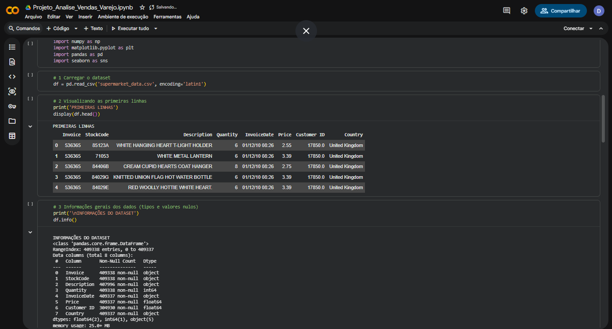
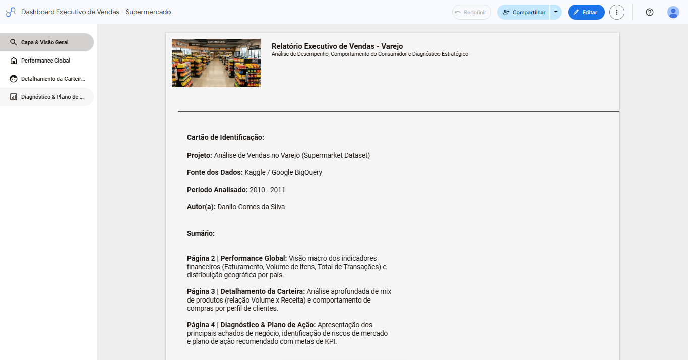

# Projeto de Análise de Vendas no Varejo (Semantix)

Este repositório contém a solução completa para o Projeto de Parceria Semantix. A análise abrange desde a extração e tratamento dos dados transacionais de varejo até a construção de um Dashboard Executivo interativo e a formulação de um plano de ação estratégico.

---

## 1. Descrição do Problema & Justificativa

O setor varejista opera com margens reduzidas e enfrenta desafios contínuos na gestão de estoque, precificação e retenção de clientes. Sem o acompanhamento detalhado dos dados transacionais, as empresas correm riscos como rupturas de estoque em itens de alta demanda, sobreposição de produtos com baixa rotatividade e dependência excessiva de mercados específicos.

A análise de dados permite transformar registros brutos de vendas em inteligência operacional, otimizando o ticket médio, diversificando a atuação geográfica e prevenindo perdas financeiras.

---

## 2. Coleta de Dados & Fonte

- **Nome do Dataset:** Supermarket Dataset (Kaggle)
- **Origem:** Repositório público no Kaggle (Autor: Saurabh Badole) / Processado via Google BigQuery.
- **Tipo de Dados:** Estruturados em formato tabular (`.csv`).
- **Estrutura das Colunas:**
  - `Invoice`: Identificador único da transação.
  - `StockCode`: Código do produto.
  - `Description`: Descrição/Nome do item.
  - `Quantity`: Quantidade comprada.
  - `InvoiceDate`: Data e hora da transação.
  - `Price`: Preço unitário.
  - `Customer ID`: Identificador único do cliente.
  - `Country`: País de origem da compra.

---

## 3. Modelagem & Tratamento dos Dados (EDA)

A etapa de tratamento foi conduzida em **Python** (Google Colab) utilizando as bibliotecas `pandas` e `matplotlib`:

1. **Filtragem de Anomalias:** Remoção de registros com quantidade negativa ou zero (`Quantity > 0`) e preços inválidos (`Price > 0`), eliminando devoluções e lançamentos incorretos.
2. **Criação de Métricas Derivadas:** Criação da coluna `TotalSales` (Quantity × Price).
3. **Higienização de Categorias:** Isolamento de taxas operacionais e custos de envio (`DOTCOM POSTAGE`, `POSTAGE`, `Manual`, `PADS`, `POST`) para garantir que os indicadores de produtos reflitam apenas o catálogo físico.


*Figura 1: Carregamento, visualização das primeiras linhas e inspeção dos tipos de dados do dataset no Google Colab.*

🔗 **Notebook completo (Colab):** https://colab.research.google.com/drive/1Or5xSQD-QlXBs-I-yILAEugh9A4DXjn_?usp=sharing

> **Nota Técnica de Otimização:** a variável de preço unitário individual foi desconsiderada da modelagem final para otimização do uso de memória e performance no ambiente de execução. As métricas financeiras essenciais (como Faturamento Total e Quantidade de Vendas) foram preservadas via variáveis agregadas, mantendo a precisão das análises do dashboard.

---

## 4. Principais Insights & Plano de Ação

- **Concentração de Risco Geográfico:** Mais de 89% do faturamento provém do Reino Unido, gerando vulnerabilidade a oscilações macroeconômicas locais.
  - *Ação Recomendada:* Campanhas de incentivo e marketing direcionadas a países de segundo escalão com alto ticket médio (Holanda, Alemanha e Irlanda).
- **Oportunidade na Precificação:** Produtos com alto volume físico de vendas apresentam preço unitário desproporcionalmente baixo em relação à receita gerada.
  - *Ação Recomendada:* Reavaliar a margem bruta de itens de alto giro e garantir contratos de fornecimento contínuo para os 10 principais produtos, evitando rupturas de estoque (*stockout*).

---

## 5. Dashboard Interativo & Visualização (Looker Studio)

O relatório executivo interativo foi desenvolvido no **Looker Studio** e estruturado em 4 visões principais:

1. **Capa & Visão Geral:** Identificação do projeto, escopo e sumário.
2. **Performance Global:** Indicadores macro (Faturamento, Volume, Transações) e mapa geográfico.
3. **Detalhamento da Carteira:** Relação Volume x Receita e análise de curva de produtos.
4. **Diagnóstico & Plano de Ação:** Apresentação dos achados de negócio e monitoramento de KPIs (Meta de Ticket Médio: R$ 15,00).


*Figura 2: Visão geral da Capa e Sumário do Dashboard no Looker Studio.*

🔗 **Link de Acesso ao Dashboard:** https://datastudio.google.com/reporting/8e9ac27c-0963-469c-abb4-7b28675151ab

---

## 6. Tecnologias Utilizadas

- Python (pandas, matplotlib)
- Google Colab / Jupyter Notebook
- Google BigQuery
- Google Looker Studio

---

## 7. Estrutura do Repositório

```
├── Projeto_Analise_Vendas_Varejo.ipynb       # Notebook com o tratamento e análise dos dados
├── Relatorio_Executivo_Analise_de_Vendas_Varejo.pdf  # Relatório executivo completo
├── supermarket_data_clean.zip                # Dataset tratado (compactado)
├── images/                                    # Imagens usadas neste README
└── README.md
```

> **Nota sobre a base de dados:** devido ao limite de tamanho de arquivos do GitHub (100 MB), o conjunto de dados tratado está disponível no repositório compactado em formato `.zip` (`supermarket_data_clean.zip`).

---

**Autor:** Danilo Gomes da Silva
